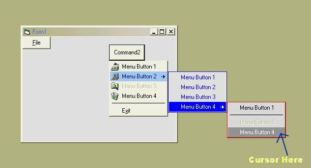



## WhizzoMenu Control \(Not Windows Menu's\)

### Description

WhizzoMenu Control.

This control uses forms,graphical effects and hard code. all you have to do is understand how to use my control to create your own menus.

This control doesn't use VB's Menu system and it doesn't use Windows Menu API.

This control is also customizable.

See the screenshot.
 
### More Info
 

             |
---                |---
**Submitted On**   |2002-07-10 21:53:42
**By**             |[CoderFromHell](https://github.com/Planet-Source-Code/PSCIndex/blob/master/ByAuthor/coderfromhell.md)
**Level**          |Advanced
**User Rating**    |4.0 (12 globes from 3 users)
**Compatibility**  |VB 5\.0, VB 6\.0
**Category**       |[Custom Controls/ Forms/  Menus](https://github.com/Planet-Source-Code/PSCIndex/blob/master/ByCategory/custom-controls-forms-menus__1-4.md)
**World**          |[Visual Basic](https://github.com/Planet-Source-Code/PSCIndex/blob/master/ByWorld/visual-basic.md)
**Archive File**   |[WhizzoMenu1046187102002\.zip](https://github.com/Planet-Source-Code/coderfromhell-whizzomenu-control-not-windows-menu-s__1-36776/archive/master.zip)

